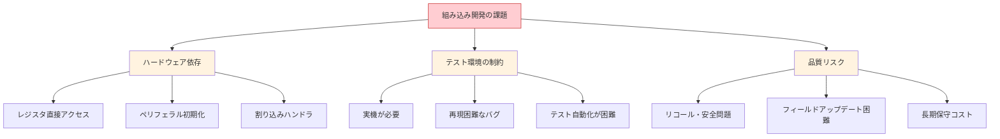
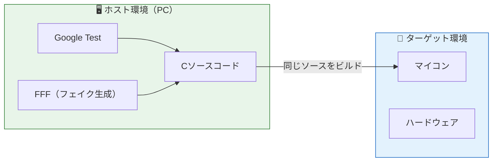
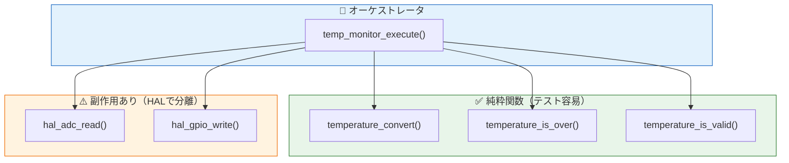
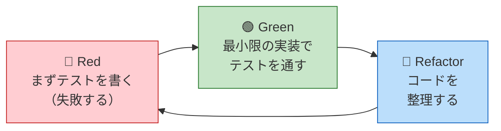
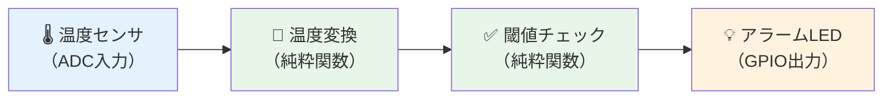

# 第1章: なぜ組み込みCでTDDが必要か

## 1.1 組み込み開発の課題

組み込みソフトウェア開発には、以下のような特有の課題があります。

### ❌ よくある問題

```
「ターゲットボードが届くまでテストできない」
「ハードウェアに依存するコードが多すぎて、バグの切り分けができない」
「テストが属人的で、毎回手動で動作確認している」
```

### 組み込み開発特有のリスク



## 1.2 解決策: ホストテスト + TDD

これらの課題を解決するアプローチが **ホスト環境でのTDD（テスト駆動開発）** です。



**ポイント**: プロダクションコード（C言語）をホストPC上でコンパイル・テストし、同じコードをターゲットにも使う。ハードウェア依存部分は **HAL（ハードウェア抽象化レイヤ）** で分離し、テスト時はフェイクに差し替える。

## 1.3 純粋関数と副作用

本教材の核心的な概念は **純粋関数** と **副作用** の分離です。

### 純粋関数とは

同じ入力に対して常に同じ出力を返し、外部の状態を変更しない関数。

```c
/* ✅ 純粋関数: テストが非常に簡単 */
int16_t temperature_convert(uint16_t raw_adc) {
    int32_t mv = (int32_t)raw_adc * 3300 / 4095;
    return (int16_t)(mv / 10);
}
```

### 副作用を持つ関数とは

ハードウェアにアクセスしたり、グローバル変数を変更する関数。

```c
/* ⚠️ 副作用あり: HAL経由でハードウェアにアクセス */
void hal_gpio_write(uint8_t pin, uint8_t state);
uint16_t hal_adc_read(uint8_t channel);
```

### 設計方針



> **原則**: ロジックは純粋関数に、ハードウェアアクセスはHAL関数に分離する。オーケストレータがこれらを組み合わせる。

## 1.4 TDD の 3 ステップ（Red → Green → Refactor）



1. **Red**: 実装前にテストを書く → 当然テストは失敗する
2. **Green**: テストが通る最小限のコードを書く
3. **Refactor**: 重複を排除し、設計を改善する（テストは通ったまま）

## 1.5 本教材の学習ゴール

| ゴール | 内容 |
|--------|------|
| テスト容易性 | 純粋関数と副作用を分離し、テストしやすい設計ができる |
| 移植性 | HAL を介してハードウェア依存を分離し、ホスト/ターゲット両方でビルドできる |
| SOLID 原則 | C言語で SOLID を適用し、変更に強い設計ができる |
| AI 活用 | AI にテストとコードを生成させ、人間がレビューする開発フローを実践できる |

## 1.6 本教材で使う題材

温度監視システムを例に学びます。


