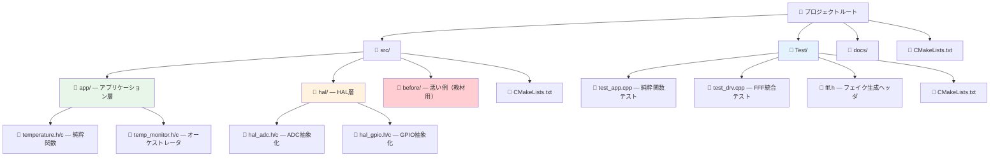
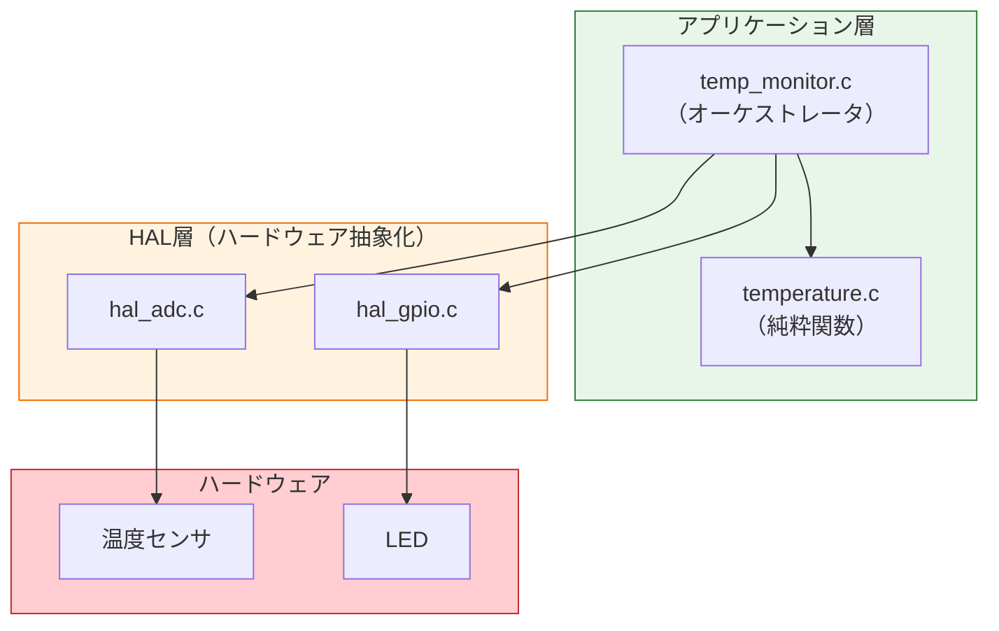
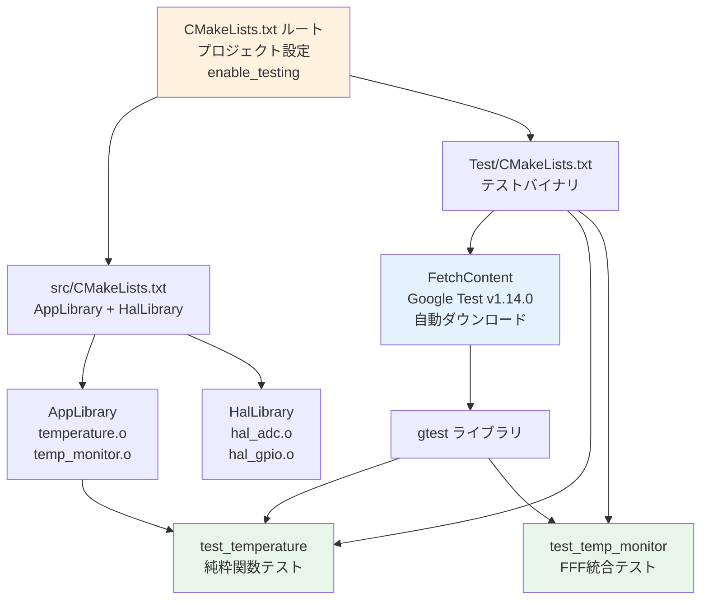
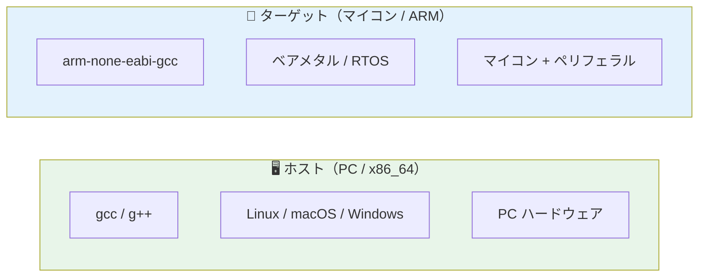

# 第2章: 環境構築

## 2.1 必要なツール

| ツール | 用途 | インストール方法 |
|--------|------|------------------|
| GCC / G++ | C/C++ コンパイラ | `sudo apt install build-essential` |
| CMake (3.14+) | ビルドシステム | `sudo apt install cmake` |
| Google Test | テストフレームワーク | CMake FetchContent で自動取得 |
| FFF (fff.h) | フェイク関数生成 | ヘッダファイル1つを配置 |

## 2.2 プロジェクト構成



### レイヤ分離の考え方



> **ポイント**: アプリケーション層は HAL のヘッダファイル（インターフェース）のみに依存する。HAL の実装（.c）はリンク時に差し替え可能。

## 2.3 CMakeによるビルドシステム

### CMakeのビルドフロー



### ルートCMakeLists.txt

```cmake
cmake_minimum_required(VERSION 3.29)
project(MyMixedProject LANGUAGES C CXX)
enable_testing()

add_subdirectory(src)
add_subdirectory(Test)

set(CMAKE_CXX_STANDARD 17)
set(CMAKE_CXX_STANDARD_REQUIRED YES)
set(CMAKE_C_STANDARD 99)
set(CMAKE_C_STANDARD_REQUIRED YES)
```

**ポイント**: `LANGUAGES C CXX` で、CとC++の両方を使うことを宣言しています。組み込みCのプロダクションコードはCで書き、テストコードはC++（Google Test）で書くという構成です。

### src/CMakeLists.txt

```cmake
# === アプリケーション層 ===
set(APP_SOURCES
    app/temperature.c
    app/temp_monitor.c
)
add_library(AppLibrary STATIC ${APP_SOURCES})
target_include_directories(AppLibrary PUBLIC app hal)

# === HAL 層 ===
set(HAL_SOURCES
    hal/hal_adc.c
    hal/hal_gpio.c
)
add_library(HalLibrary STATIC ${HAL_SOURCES})
target_include_directories(HalLibrary PUBLIC hal)

target_link_libraries(AppLibrary PUBLIC HalLibrary)
```

### Test/CMakeLists.txt

```cmake
include(FetchContent)
FetchContent_Declare(
  googletest
  URL https://github.com/google/googletest/archive/refs/tags/v1.14.0.zip
)
FetchContent_MakeAvailable(googletest)

# 純粋関数テスト（フェイク不要）
add_executable(test_temperature test_app.cpp)
target_link_libraries(test_temperature gtest_main AppLibrary)
gtest_discover_tests(test_temperature)

# FFF 統合テスト（HAL をフェイクに差し替え）
add_executable(test_temp_monitor test_drv.cpp)
target_link_libraries(test_temp_monitor gtest_main)
target_include_directories(test_temp_monitor PRIVATE
    ${CMAKE_SOURCE_DIR}/src/app
    ${CMAKE_SOURCE_DIR}/src/hal
    ${CMAKE_CURRENT_SOURCE_DIR}
)
target_sources(test_temp_monitor PRIVATE
    ${CMAKE_SOURCE_DIR}/src/app/temp_monitor.c
    ${CMAKE_SOURCE_DIR}/src/app/temperature.c
)
gtest_discover_tests(test_temp_monitor)
```

> **重要**: `test_temp_monitor` は HalLibrary をリンクしません。代わりに FFF がテストファイル内で HAL 関数のフェイク実装を生成するため、リンカエラーにならずにテストできます。

## 2.4 ホスト環境とターゲット環境の違い



| 項目 | ホスト | ターゲット |
|------|--------|------------|
| コンパイラ | gcc / g++ | arm-none-eabi-gcc 等 |
| アーキテクチャ | x86_64 | ARM Cortex-M 等 |
| OS | Linux / macOS / Windows | ベアメタル / RTOS |
| メモリ | 数GB | 数KB〜数MB |
| ペリフェラル | なし | ADC, GPIO, UART, SPI... |
| テスト方法 | Google Test + FFF | 手動 / JTAG |

### 意識すべき差異

- **型サイズ**: `int` がホストでは32bit/64bit、ターゲットでは16bit/32bitの場合がある。`stdint.h`（`uint16_t` 等）を使うことで差異を吸収。
- **エンディアン**: ホストはリトルエンディアンだがターゲットがビッグエンディアンの場合がある。
- **浮動小数点**: ターゲットにFPUがない場合、浮動小数点演算は避ける → 本教材では整数演算（×10 表現）を使用。
- **アラインメント**: 構造体のパディングが異なる場合がある。

## 2.5 ビルドと実行

```bash
# 1. ビルドディレクトリ作成
mkdir build && cd build

# 2. CMake 設定
cmake ..

# 3. ビルド
cmake --build .

# 4. テスト実行
ctest --output-on-failure
```

実行結果（全16テストがパス）:

```
100% tests passed, 0 tests failed out of 16
```
