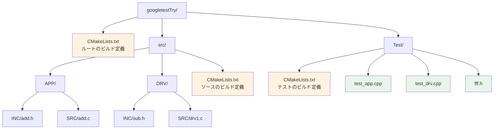
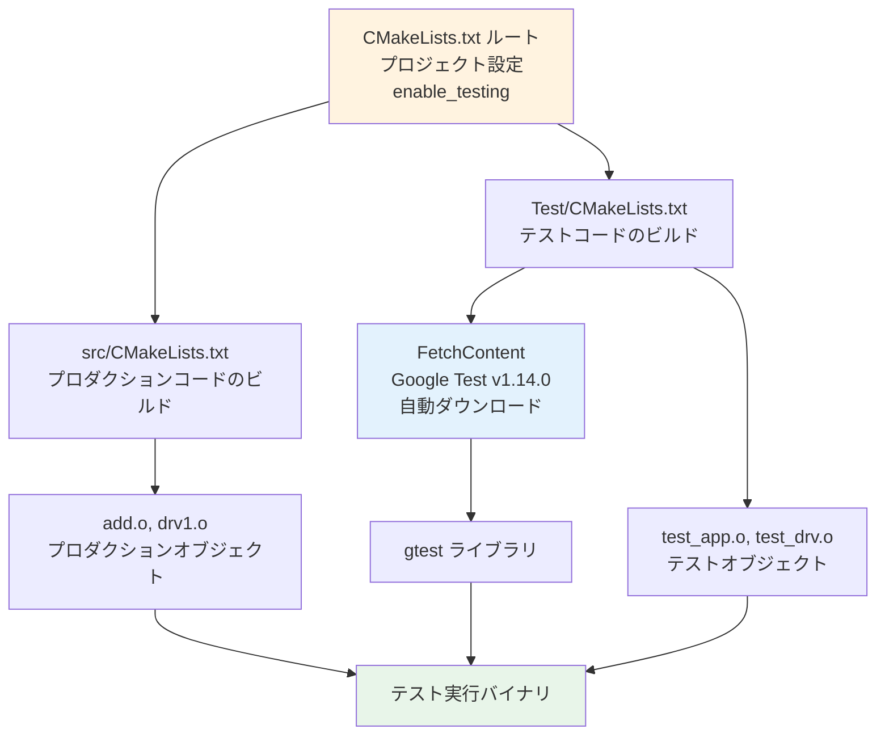
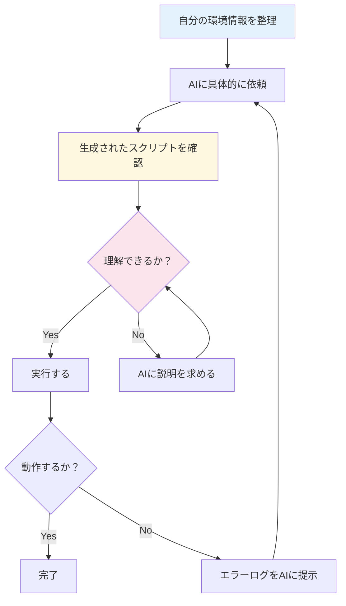
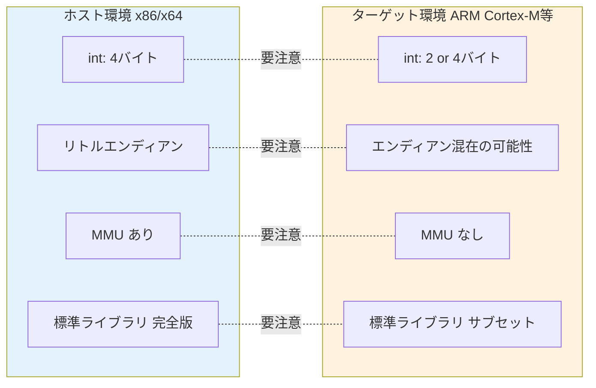

# 第2章: 環境構築 — AIを活用してテスト環境を整える

## 2.1 必要なツール

本教材で使用するツールは以下の通りです。

| ツール | 用途 | バージョン目安 |
|-------|------|-------------|
| CMake | ビルドシステム | 3.29以上 |
| GCC/G++ | C/C++コンパイラ | 11以上 |
| Google Test | テストフレームワーク | 1.14.0 |
| FFF | フェイク関数フレームワーク | 最新 |
| Git | バージョン管理 | 2.x |
| AI ツール | コード生成支援 | GitHub Copilot等 |

## 2.2 プロジェクト構成の理解

本教材のプロジェクトは以下の構成になっています。



### ディレクトリの役割

- **`src/APP/`**: アプリケーション層のコード。ビジネスロジックを担当
- **`src/DRV/`**: ドライバ層のコード。ハードウェアアクセスを担当
- **`Test/`**: テストコード。Google TestとFFFを使ったテストファイル

この**APP（アプリケーション層）とDRV（ドライバ層）の分離**は、組み込み開発において非常に重要な設計判断です。後の章で学ぶポートアダプタパターンの基礎となります。

> **命名規約について**: 本プロジェクトの既存コードでは `doubleForFake` のようなキャメルケース（camelCase）を使用していますが、第6章以降の新しいサンプルコードでは `read_temperature` のようなスネークケース（snake_case）を使用しています。組み込みC開発ではスネークケースが一般的ですが、既存のプロジェクトに合わせることも重要です。

## 2.3 CMakeによるビルドシステム

### CMakeのビルドフロー



### ルートCMakeLists.txt

```cmake
cmake_minimum_required(VERSION 3.29)
project(MyMixedProject LANGUAGES C CXX)
enable_testing()

add_subdirectory(src)
add_subdirectory(Test)

set(CMAKE_CXX_STANDARD 17)
set(CMAKE_CXX_STANDARD_REQUIRED YES)
set(CMAKE_C_STANDARD 99)
set(CMAKE_C_STANDARD_REQUIRED YES)
```

**ポイント**: `LANGUAGES C CXX` で、CとC++の両方を使うことを宣言しています。組み込みCのプロダクションコードはCで書き、テストコードはC++（Google Test）で書くという構成です。

### テストのCMakeLists.txt

```cmake
include(FetchContent)
FetchContent_Declare(
  googletest
  URL https://github.com/google/googletest/archive/refs/tags/v1.14.0.zip
)
FetchContent_MakeAvailable(googletest)
```

`FetchContent` を使って Google Test を自動的にダウンロードします。これにより、事前のインストール作業が不要になります。

## 2.4 AIを活用した環境構築

### AIへの依頼の仕方

環境構築は、AIに支援を依頼する好適な場面です。ただし、いくつかの注意点があります。



**AIへの依頼例（良い例）**:
```
CMake 3.29 + GCC 11 + Google Test 1.14.0 の環境で、
C言語のプロダクションコード（src/以下）を
C++のテストコード（Test/以下）からテストする
CMakeLists.txtを作成してください。
FetchContentでGoogle Testを取得する構成にしてください。
```

**AIへの依頼例（悪い例）**:
```
テストできるようにして
```

### 人間が確認すべきポイント

AIが生成した環境構築スクリプトに対して、以下を確認しましょう。

1. **コンパイラバージョン** — ターゲットのCコンパイラと互換性があるC標準か
2. **リンク設定** — テストバイナリにプロダクションコードが正しくリンクされているか
3. **インクルードパス** — ヘッダファイルが正しく参照されているか
4. **`extern "C"` の扱い** — C++からCの関数を呼ぶ場合に必要

## 2.5 ビルドと実行

### ビルド手順

```bash
# ビルドディレクトリを作成
mkdir build && cd build

# CMakeの設定（ジェネレート）
cmake ..

# ビルド
cmake --build .

# テスト実行
ctest --output-on-failure
```

### 実行結果の例

テストが成功すると、以下のような出力が得られます。

```
[==========] Running 2 tests from 1 test suite.
[----------] Global test environment set-up.
[----------] 2 tests from add_test
[ RUN      ] add_test.addOK
[       OK ] add_test.addOK (0 ms)
[ RUN      ] add_test.addNG
[       OK ] add_test.addNG (0 ms)
[----------] 2 tests from add_test (0 ms total)
[==========] 2 tests from 1 test suite ran. (0 ms total)
[  PASSED  ] 2 tests.
```

この**即座のフィードバック**こそが、ホスト環境テストの最大の利点です。

## 2.6 ホスト環境とターゲット環境の差異

ホスト環境でテストする際、以下の差異に注意が必要です。



| 差異ポイント | 影響 | 対策 |
|------------|------|------|
| 整数型のサイズ | `int` が 2byte と 4byte で異なる動作 | `stdint.h` の固定幅型を使用 |
| エンディアン | バイトオーダーの違いで通信データが壊れる | エンディアン変換マクロを用意 |
| メモリモデル | ヒープの使い方が異なる | 組み込みでは `malloc` を避ける |
| ハードウェアアクセス | レジスタ操作がホストにない | モック/スタブで置き換え |
| 割り込み | ホストにはない | テスト用の割り込みシミュレータを用意 |

**重要**: ホスト環境テストは万能ではありません。ロジックのテストには最適ですが、タイミングやハードウェア固有の挙動はターゲット環境でのテストが必要です。
