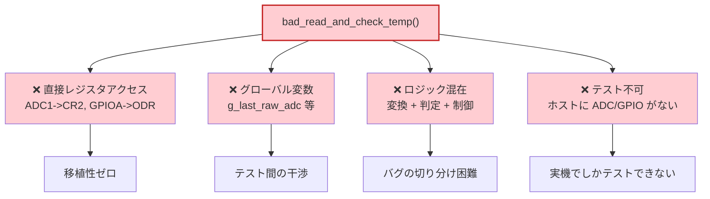
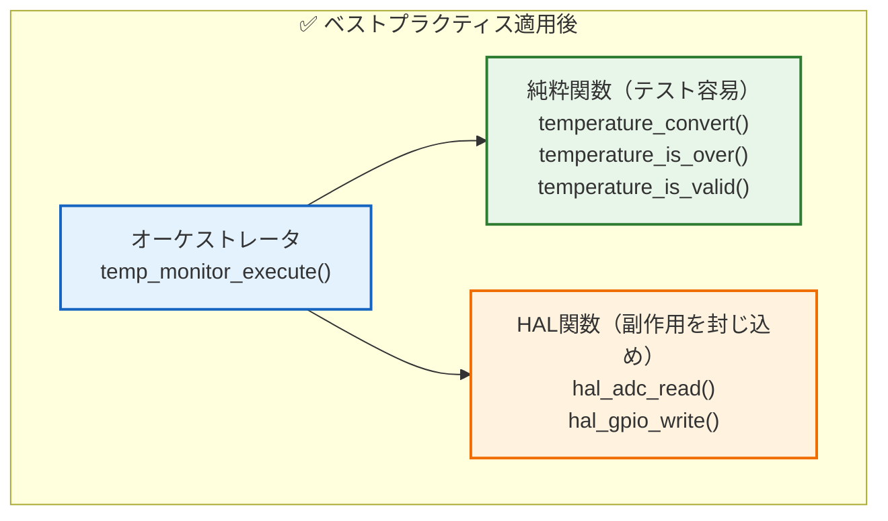
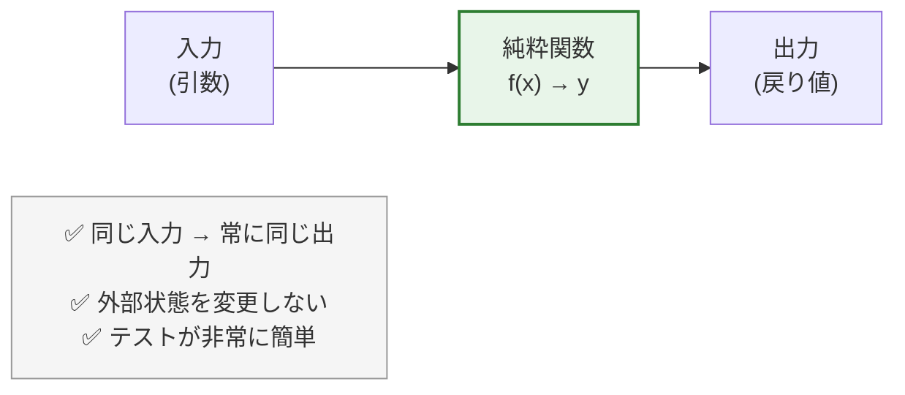
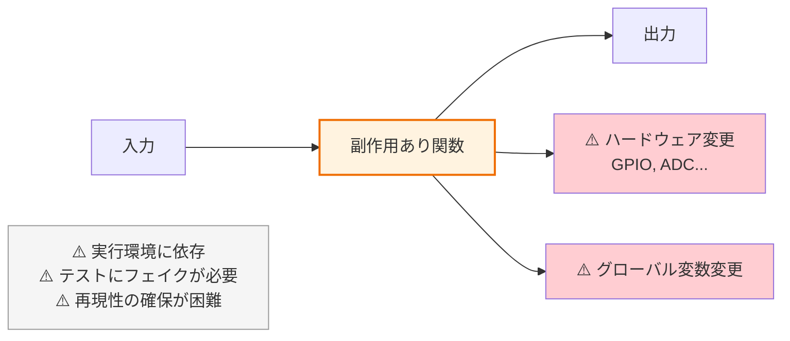
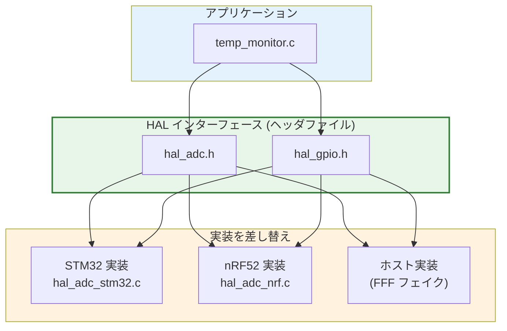
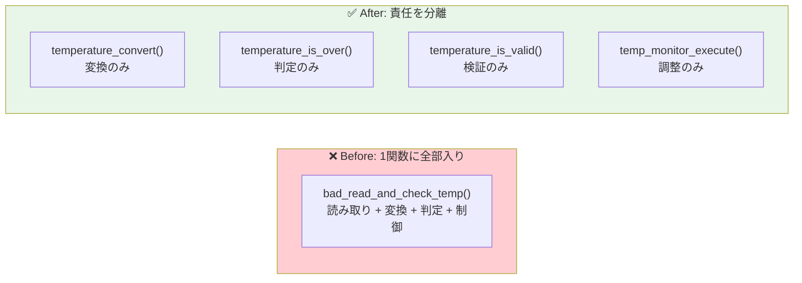
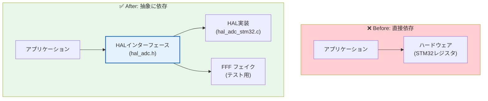
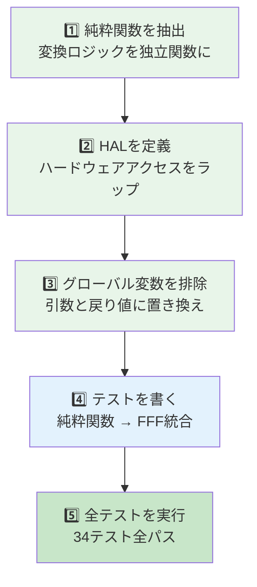

# 第2章: テスト容易性の原則とベストプラクティス

## 2.1 悪い例（Before）— テスト困難なコード

組み込み開発でよく見る「テストできないコード」の典型例を示します。

### ❌ Before: bad_temp.c

```c
/* グローバル変数 */
volatile uint16_t g_last_raw_adc = 0;
volatile int16_t g_last_temperature = 0;
volatile uint8_t g_alarm_active = 0;

void bad_read_and_check_temp(void) {
    // ❌ 直接ハードウェアレジスタにアクセス → ホストで実行不可
    ADC1->CR2 |= ADC_CR2_SWSTART;
    while (!(ADC1->SR & ADC_SR_EOC)) {}
    g_last_raw_adc = ADC1->DR;

    // ❌ ロジックとハードウェアが混在
    int32_t mv = (int32_t)g_last_raw_adc * 3300 / 4095;
    g_last_temperature = (int16_t)(mv / 10);

    // ❌ 閾値チェックと GPIO 制御が一体化
    if (g_last_temperature > 500) {
        GPIOA->ODR |= (1 << 13);   // 直接レジスタアクセス
        g_alarm_active = 1;
    } else {
        GPIOA->ODR &= ~(1 << 13);
        g_alarm_active = 0;
    }
}
```

### この悪いコードの問題点



## 2.2 良い例（After）— テスト容易な設計

### ✅ After: 3つのレイヤに分離



### ✅ After: temperature.c（純粋関数）

```c
/* 純粋関数: 入力→出力のみ、副作用なし */
int16_t temperature_convert(uint16_t raw_adc) {
    int32_t mv = (int32_t)raw_adc * 3300 / 4095;
    return (int16_t)(mv / 10);
}

int temperature_is_over(int16_t temp_x10, int16_t threshold_x10) {
    return (temp_x10 > threshold_x10) ? 1 : 0;
}

int temperature_is_valid(uint16_t raw_adc) {
    if (raw_adc == 0 || raw_adc >= 4095) {
        return 0;
    }
    return 1;
}
```

### ✅ After: temp_monitor.c（オーケストレータ）

```c
int16_t temp_monitor_execute(void) {
    uint16_t raw = hal_adc_read(TEMP_ADC_CHANNEL);  /* 副作用 */
    
    if (!temperature_is_valid(raw)) {                 /* 純粋関数 */
        hal_gpio_write(ALARM_LED_PIN, 1);             /* 副作用 */
        return -9999;
    }
    
    int16_t temp = temperature_convert(raw);          /* 純粋関数 */
    int over = temperature_is_over(temp, ALARM_THRESHOLD_X10); /* 純粋関数 */
    hal_gpio_write(ALARM_LED_PIN, (uint8_t)over);     /* 副作用 */
    
    return temp;
}
```

## 2.3 Before vs After 比較

| 項目 | ❌ Before | ✅ After |
|------|-----------|----------|
| ハードウェアアクセス | 直接レジスタ操作 | HAL 関数経由 |
| グローバル変数 | 3つ使用 | なし（引数と戻り値で受け渡し） |
| 関数の責務 | 1関数に全部入り | 変換、判定、制御を分離 |
| テスト方法 | 実機でしかテスト不可 | ホストで全テスト可能 |
| 移植性 | STM32 専用 | HAL 差し替えで任意のMCU対応 |
| テスト数 | 0 | 16 |

## 2.4 純粋関数 vs 副作用 — 詳細

### 純粋関数の特徴



**テスト方法**: 入力を与えて出力を検証するだけ。

```cpp
TEST(TemperatureConvert, ZeroInput) {
    EXPECT_EQ(0, temperature_convert(0));  // これだけ！
}
```

### 副作用を持つ関数の特徴



**テスト方法**: FFF でハードウェア関数をフェイクに差し替え、引数と呼び出し回数を検証。

```cpp
TEST_F(TempMonitorTest, SensorDisconnected_ReturnsError) {
    hal_adc_read_fake.return_val = 0;       // フェイクの戻り値を設定
    int16_t result = temp_monitor_execute(); // テスト実行
    EXPECT_EQ(result, -9999);               // 出力を検証
    EXPECT_EQ(hal_gpio_write_fake.arg1_val, 1);  // 副作用を検証
}
```

## 2.5 移植性の確保

### HAL によるハードウェア抽象化



> **ポイント**: アプリケーションコードは HAL ヘッダ（.h）のみに依存。リンク時に実装（.c）を差し替えることで、同じアプリケーションコードが STM32 でも nRF52 でもホストテストでも動作する。

### 移植性を高めるコーディング規約

| 規約 | 理由 | 例 |
|------|------|-----|
| `stdint.h` の型を使う | 型サイズの違いを吸収 | `uint16_t` not `unsigned short` |
| 浮動小数点を避ける | FPU のないMCU対応 | `int16_t temp_x10` (×10表現) |
| 直接レジスタアクセスしない | 移植性確保 | `hal_adc_read()` not `ADC1->DR` |
| グローバル変数を避ける | テスト容易性 | 引数と戻り値で受け渡し |
| `volatile` は HAL 内に限定 | 最適化の影響を限定 | HAL 実装の中だけで使用 |

## 2.6 SOLID 原則（C言語への適用）

### S: 単一責任の原則（SRP）

> 「関数（モジュール）は1つの責任のみを持つべき」



### O: 開放閉鎖の原則（OCP）

> 「拡張に対して開いていて、修正に対して閉じているべき」

HAL のヘッダを変えずに、新しいターゲットの実装ファイルを追加できる。

### D: 依存性逆転の原則（DIP）

> 「上位モジュールは下位モジュールに依存すべきでない。両者は抽象に依存すべき」



C言語での DIP の実現方法:

| 方法 | 説明 | 本教材の採用 |
|------|------|-------------|
| ヘッダ + リンカ差し替え | ヘッダで関数宣言、リンク時に実装を選択 | ✅ 採用 |
| 関数ポインタ | 実行時に実装を差し替え | 応用例 |
| コンパイルスイッチ | `#ifdef` でターゲットを切り替え | 補助的に使用 |

## 2.7 リファクタリングの手順



> **ポイント**: リファクタリングは一度に全部やるのではなく、1ステップずつ進めてテストで確認しながら進める。
