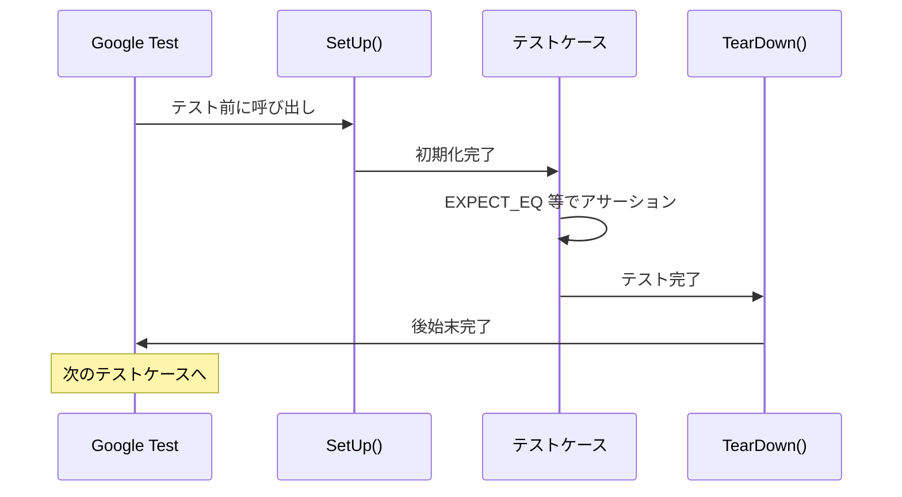
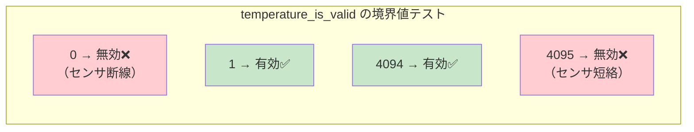
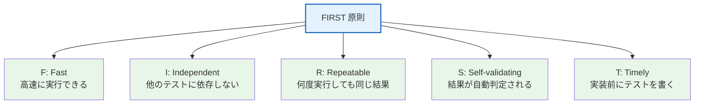

# 第3章: Google Test の基本

## 3.1 Google Test とは

Google Test は C++ 用のテストフレームワークです。組み込みC のコードを `extern "C"` で囲むことで、C 関数を C++ テストから呼び出せます。

### extern "C" と名前マングリング

C++ コンパイラは関数名を「名前マングリング」で装飾します。例えば `add(int, int)` は `_Z3addii` のような名前になります。C コンパイラはこの装飾をしないため、`extern "C"` で「この関数はC言語の命名規則で探してね」と指示する必要があります。

```cpp
// ❌ これだと C 関数が見つからない（リンクエラー）
#include "temperature.h"

// ✅ extern "C" で C の命名規則を指定
extern "C" {
#include "temperature.h"
}
```

## 3.2 テストの基本構造

### TEST マクロ（最もシンプル）

```cpp
#include "gtest/gtest.h"

extern "C" {
#include "temperature.h"
}

TEST(TemperatureConvert, ZeroInput) {
    EXPECT_EQ(0, temperature_convert(0));
}
```

- 第1引数: テストスイート名（機能や関数の名前）
- 第2引数: テストケース名（テストの目的）

### TEST_F マクロ（フィクスチャ付き）

複数テストで共通の初期化・後始末が必要な場合に使います。

```cpp
class TemperatureConvertTest : public ::testing::Test {
protected:
    void SetUp() override {
        // 各テスト前に呼ばれる
    }
    void TearDown() override {
        // 各テスト後に呼ばれる
    }
};

TEST_F(TemperatureConvertTest, ZeroRawReturnsZero) {
    EXPECT_EQ(0, temperature_convert(0));
}

TEST_F(TemperatureConvertTest, MaxRawValue) {
    EXPECT_EQ(330, temperature_convert(4095));
}
```



## 3.3 主要なアサーションマクロ

| マクロ | 意味 | 失敗時の動作 |
|--------|------|-------------|
| `EXPECT_EQ(expected, actual)` | 等しい | テスト続行 |
| `EXPECT_NE(val1, val2)` | 等しくない | テスト続行 |
| `EXPECT_GT(val1, val2)` | val1 > val2 | テスト続行 |
| `EXPECT_GE(val1, val2)` | val1 >= val2 | テスト続行 |
| `EXPECT_LT(val1, val2)` | val1 < val2 | テスト続行 |
| `EXPECT_LE(val1, val2)` | val1 <= val2 | テスト続行 |
| `EXPECT_TRUE(condition)` | 真 | テスト続行 |
| `EXPECT_FALSE(condition)` | 偽 | テスト続行 |
| `ASSERT_EQ(expected, actual)` | 等しい | **テスト中断** |

> **EXPECT vs ASSERT**: `EXPECT_*` は失敗してもテストを続行し、全ての失敗を報告します。`ASSERT_*` は失敗した時点でテストを中断します。

## 3.4 実例: 純粋関数のテスト

本プロジェクトの `test_app.cpp`（test_temperature）は純粋関数のみをテストしています。

```cpp
#include "gtest/gtest.h"

extern "C" {
#include "temperature.h"
}

class TemperatureConvertTest : public ::testing::Test {};

// ADC 0 → 0mV → 0℃
TEST_F(TemperatureConvertTest, ZeroRawReturnsZero) {
    EXPECT_EQ(0, temperature_convert(0));
}

// ADC 2048 → 約1650mV → 約16.5℃
TEST_F(TemperatureConvertTest, MidRangeValue) {
    int16_t result = temperature_convert(2048);
    EXPECT_GE(result, 160);
    EXPECT_LE(result, 170);
}

// ADC 4095 → 3300mV → 33.0℃
TEST_F(TemperatureConvertTest, MaxRawValue) {
    EXPECT_EQ(330, temperature_convert(4095));
}
```

> **ポイント**: 純粋関数は入力と出力だけを検証すればよいため、フェイクもモックも不要です。これが「テスト容易性」の好例です。

### テスト設計: 境界値



```cpp
TEST_F(TemperatureIsValidTest, ZeroIsInvalid) {
    EXPECT_EQ(0, temperature_is_valid(0));
}
TEST_F(TemperatureIsValidTest, LowValidValue) {
    EXPECT_EQ(1, temperature_is_valid(1));
}
TEST_F(TemperatureIsValidTest, HighValidValue) {
    EXPECT_EQ(1, temperature_is_valid(4094));
}
TEST_F(TemperatureIsValidTest, MaxIsInvalid) {
    EXPECT_EQ(0, temperature_is_valid(4095));
}
```

## 3.5 FIRST 原則

良いユニットテストの特性:



| 原則 | 説明 | 本教材での実践 |
|------|------|-------------|
| Fast | ミリ秒単位で完了 | 16テストが0.04秒で完了 |
| Independent | テスト間で状態を共有しない | SetUp() で毎回リセット |
| Repeatable | 環境に依存しない | HAL をフェイク化して環境非依存 |
| Self-validating | PASS/FAIL が自動判定 | EXPECT_EQ 等で自動チェック |
| Timely | 実装前にテストを書く | TDD の Red-Green-Refactor |
