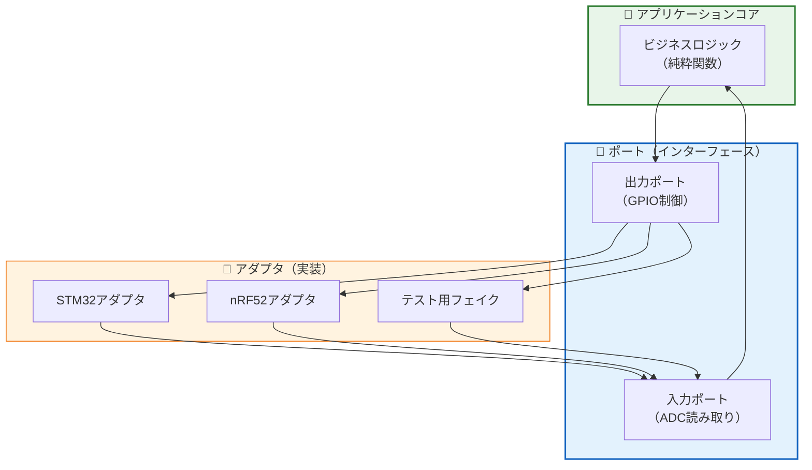
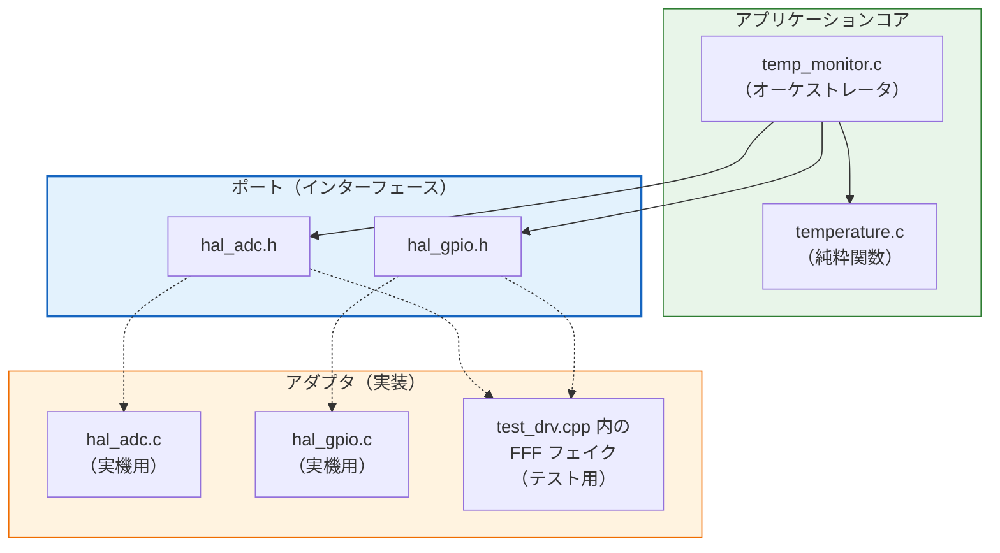
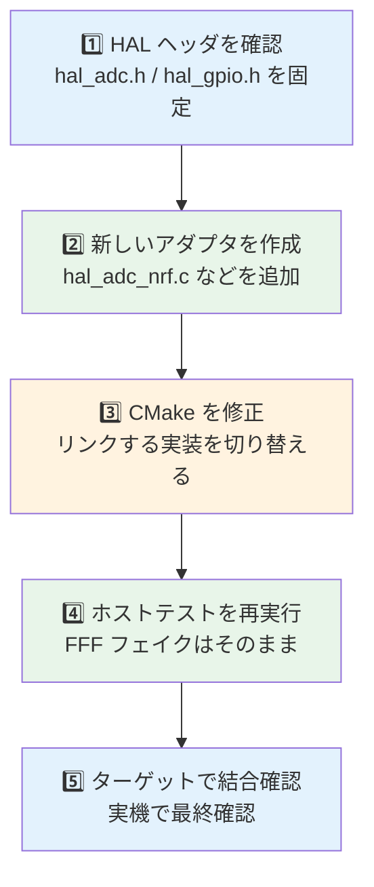
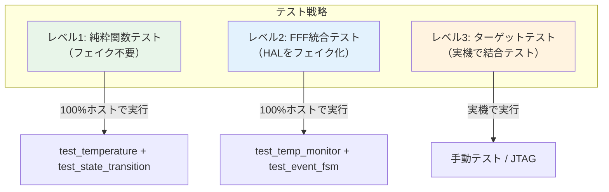

# 第3章: ポートアダプタで境界を設計する

## 3.1 Before: アプリケーションがターゲット実装を直接知っている

ポートアダプタ導入前は、アプリケーションがターゲット別 API を直接呼びがちです。

```c
void bad_temp_app_step(void) {
#if defined(TARGET_STM32)
    uint16_t raw = stm32_adc_read_blocking();
    if (raw > 3000) {
        stm32_gpio_write(ALARM_LED_PIN, 1);
    }
#elif defined(TARGET_NRF52)
    uint16_t raw = nrf_saadc_sample_blocking();
    if (raw > 3000) {
        nrf_gpio_pin_write(ALARM_LED_PIN, 1);
    }
#endif
}
```

問題点:

- アプリケーションがターゲット別 API を直接知っている
- 新ターゲット追加のたびにアプリ側を修正する
- ホストテスト時に差し替える境界がない

## 3.2 ポートアダプタとは

ポートアダプタパターン（別名: ヘキサゴナルアーキテクチャ）は、アプリケーションのコアロジックを外部依存から分離する設計パターンです。



## 3.3 本教材での実現

DIP（第2章）で学んだ原則を、アーキテクチャレベルで適用したものがポートアダプタです。

| ポートアダプタの概念 | 本教材での実装 | ファイル |
|--------------------|---------------|---------|
| アプリケーションコア | 純粋関数群 | `temperature.c` |
| オーケストレータ | 統合ロジック | `temp_monitor.c` |
| ポート | HAL ヘッダファイル | `hal_adc.h`, `hal_gpio.h` |
| 実機アダプタ | HAL 実装 | `hal_adc.c`, `hal_gpio.c` |
| テストアダプタ | FFF フェイク | `test_drv.cpp` 内 |



## 3.4 SOLID / DIP の観点

### S: 単一責任の原則

- Before: アプリケーションがロジックとターゲット制御の両方を担当
- After: コアロジックはアプリ層、ハードウェア差分はアダプタ層へ分離

### D: 依存性逆転の原則

- Before: 上位のアプリケーションが `stm32_*` や `nrf_*` の具体 API に依存
- After: 上位は `hal_adc.h` や `hal_gpio.h` という抽象ポートに依存

### O: 開放閉鎖の原則

- 新しいターゲットを追加するときはアダプタを追加し、アプリケーションコードは変更しない

## 3.5 副作用とテストをどう分けるか

ポートアダプタの狙いは、副作用を消すことではなく、副作用の位置を境界の外へ押し出すことです。

```c
int16_t temp_monitor_execute(void) {
    uint16_t raw_adc = hal_adc_read(TEMP_ADC_CHANNEL);

    if (!temperature_is_valid(raw_adc)) {
        hal_gpio_write(ALARM_LED_PIN, 1);
        return TEMP_MONITOR_ERROR;
    }

    int16_t temp_x10 = temperature_convert(raw_adc);
    hal_gpio_write(ALARM_LED_PIN,
                   temperature_is_over(temp_x10, TEMP_ALARM_THRESHOLD_X10));
    return temp_x10;
}
```

テスト観点:

- 純粋関数は Google Test だけで直接テストする
- オーケストレータは FFF でポートを差し替えて検証する
- 実機アダプタは最後にターゲットで結合確認する

```cpp
TEST_F(TempMonitorTest, HighTemperature_LedOn) {
    hal_adc_read_fake.return_val = 4000;

    int16_t result = temp_monitor_execute();

    EXPECT_GT(result, TEMP_ALARM_THRESHOLD_X10);
    EXPECT_EQ(1, hal_gpio_write_fake.arg1_val);
}
```

## 3.6 新しいターゲットへの移植手順



> **ポイント**: アプリケーションコード（`temperature.c`, `temp_monitor.c`）は一切変更不要です。HAL の実装ファイルだけを追加すれば、新しいハードウェアに対応できます。

## 3.7 テスト戦略



| レベル | 対象 | 方法 | カバー範囲 |
|--------|------|------|-----------|
| 純粋関数テスト | `temperature.c`, `temp_alarm_transition()` | Google Test のみ | 変換・判定・遷移ロジック |
| FFF統合テスト | `temp_monitor.c`, ISR/イベントラッパ | Google Test + FFF | ポート境界とイベント伝搬 |
| ターゲットテスト | HAL 実装 | 実機 + JTAG | ハードウェア接続 |

> **目標**: レベル1 と レベル2 でバグの大半を検出し、ターゲットテストは接続確認と最終保証に集中する。

現在のホスト側テストは `test_temperature`, `test_temp_monitor`, `test_event_fsm`, `test_state_transition`, `test_autosar_hal` の5バイナリで構成され、最新確認では 34 テストがすべてパスしています。
