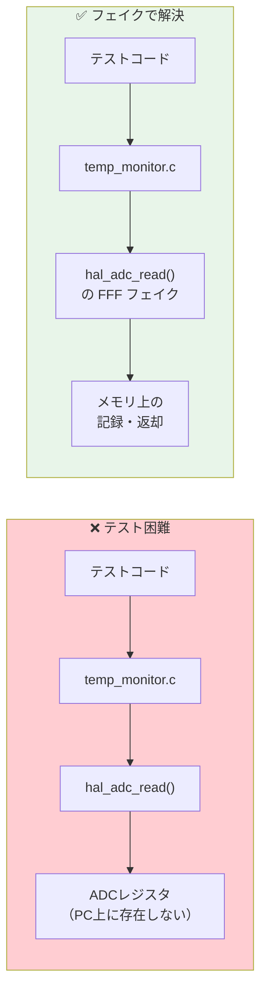
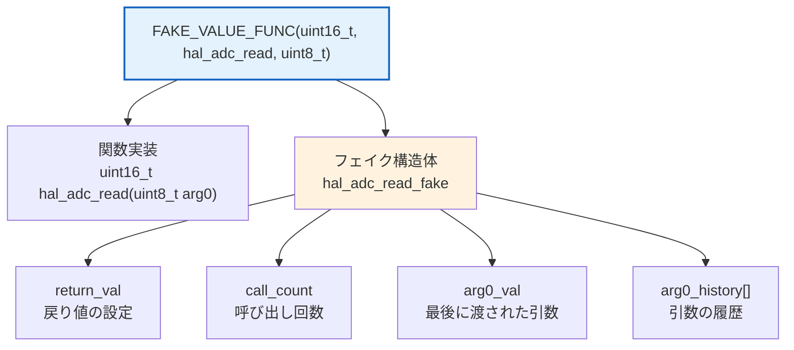
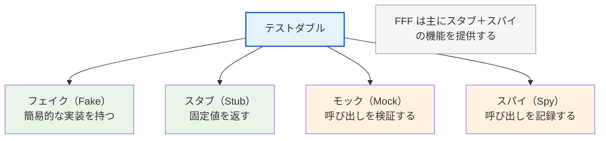

# 第4章: FFF によるフェイク関数

## 4.1 なぜフェイクが必要か

組み込みCでは、多くの関数がハードウェアにアクセスする「副作用」を持ちます。これらの関数はホスト環境では実行できません。



## 4.2 FFF（Fake Function Framework）とは

FFF は C/C++ 用のフェイク関数生成フレームワークです。**ヘッダファイル1つ（`fff.h`）** を配置するだけで使えます。

### 基本的な使い方

```cpp
#include "fff.h"
DEFINE_FFF_GLOBALS;  // グローバル変数を定義（テストファイルに1つ）

// void 関数のフェイク: FAKE_VOID_FUNC(関数名, 引数型...)
FAKE_VOID_FUNC(hal_gpio_write, uint8_t, uint8_t);
FAKE_VOID_FUNC(hal_adc_init);

// 戻り値ありの関数のフェイク: FAKE_VALUE_FUNC(戻り型, 関数名, 引数型...)
FAKE_VALUE_FUNC(uint16_t, hal_adc_read, uint8_t);
FAKE_VALUE_FUNC(uint8_t, hal_gpio_read, uint8_t);
```

### FFF が生成するもの



## 4.3 実例: HAL 関数のフェイク化

本プロジェクトの `test_drv.cpp`（test_temp_monitor）の例:

```cpp
#include "gtest/gtest.h"
#include "fff.h"
DEFINE_FFF_GLOBALS;

extern "C" {
#include "temp_monitor.h"
#include "hal_adc.h"
#include "hal_gpio.h"
}

/* HAL 関数をフェイクに差し替え */
FAKE_VALUE_FUNC(uint16_t, hal_adc_read, uint8_t);
FAKE_VOID_FUNC(hal_adc_init);
FAKE_VOID_FUNC(hal_gpio_write, uint8_t, uint8_t);
FAKE_VALUE_FUNC(uint8_t, hal_gpio_read, uint8_t);
```

### テスト前のリセット

```cpp
class TempMonitorTest : public ::testing::Test {
protected:
    void SetUp() override {
        RESET_FAKE(hal_adc_read);
        RESET_FAKE(hal_adc_init);
        RESET_FAKE(hal_gpio_write);
        RESET_FAKE(hal_gpio_read);
        FFF_RESET_HISTORY();
    }
};
```

> **重要**: `RESET_FAKE` で各フェイクの呼び出しカウントや引数履歴をリセットします。`FFF_RESET_HISTORY` で呼び出し順序の履歴もリセット。これにより FIRST 原則の **Independent**（テスト間で状態を共有しない）を実現します。

## 4.4 テストパターン

### パターン1: 戻り値の制御

```cpp
TEST_F(TempMonitorTest, NormalTemperature_LedOff) {
    // ADC に返させたい値を設定
    hal_adc_read_fake.return_val = 1000;  // ADC 1000 → 約8.0℃

    int16_t result = temp_monitor_execute();

    // 温度が閾値未満なので LED は OFF
    EXPECT_EQ(hal_gpio_write_fake.arg1_val, 0);
}
```

### パターン2: 呼び出し回数の検証

```cpp
TEST_F(TempMonitorTest, CallOrder_ReadThenWrite) {
    hal_adc_read_fake.return_val = 2000;

    temp_monitor_execute();

    // ADC read が1回、GPIO write が1回
    EXPECT_EQ(hal_adc_read_fake.call_count, 1);
    EXPECT_EQ(hal_gpio_write_fake.call_count, 1);
}
```

### パターン3: 引数の検証

```cpp
TEST_F(TempMonitorTest, HighTemperature_LedOn) {
    hal_adc_read_fake.return_val = 4000;  // 高温

    temp_monitor_execute();

    // GPIO write に正しいピン番号と状態が渡されたか
    EXPECT_EQ(hal_gpio_write_fake.arg0_val, ALARM_LED_PIN);  // ピン13
    EXPECT_EQ(hal_gpio_write_fake.arg1_val, 1);               // ON
}
```

### パターン4: 異常系

```cpp
TEST_F(TempMonitorTest, SensorDisconnected_ReturnsError) {
    hal_adc_read_fake.return_val = 0;  // センサ断線

    int16_t result = temp_monitor_execute();

    EXPECT_EQ(result, -9999);  // エラー値
    EXPECT_EQ(hal_gpio_write_fake.arg1_val, 1);  // アラーム ON
}
```

## 4.5 テストダブルの分類



| 種類 | 役割 | FFF での実現 |
|------|------|-------------|
| スタブ | `return_val` で戻り値を制御 | `hal_adc_read_fake.return_val = 1000;` |
| スパイ | `call_count`, `arg0_val` で呼び出しを記録 | `EXPECT_EQ(hal_gpio_write_fake.call_count, 1);` |
| フェイク | `custom_fake` でカスタム実装 | `hal_adc_read_fake.custom_fake = my_impl;` |

## 4.6 FFF vs 他のアプローチ

| アプローチ | 長所 | 短所 |
|-----------|------|------|
| FFF | ヘッダ1つで導入可能、C 関数に対応 | C++ 機能は限定的 |
| GMock | 高機能、詳細な期待設定 | C++ クラス前提、C 関数には工夫が必要 |
| 手動スタブ | 自由度が高い | 手書きの手間、バグ混入リスク |
| リンカ差し替え | シンプル | ファイル管理が煩雑 |

> **推奨**: 組み込みC のテストには FFF が最もバランスが良い。ヘッダ1つで導入でき、C 関数のフェイクを簡単に生成できる。
