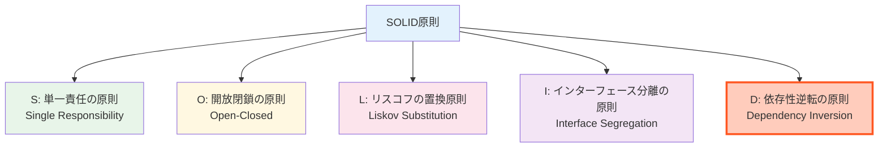
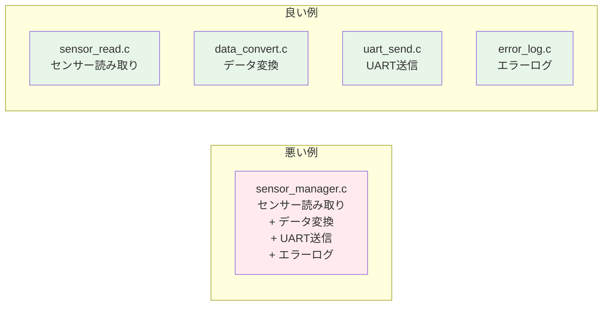
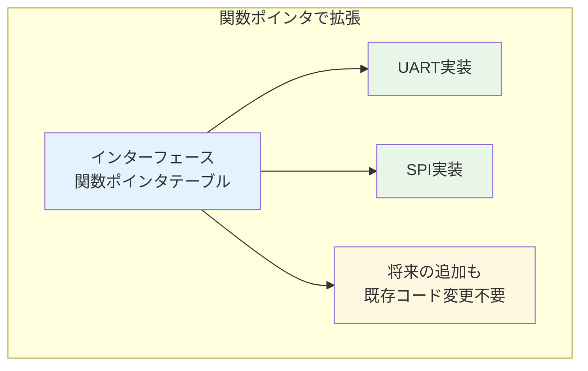
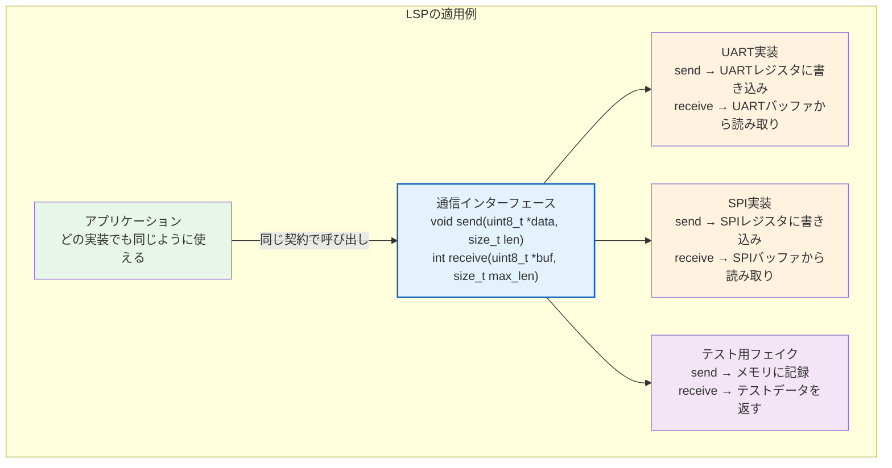
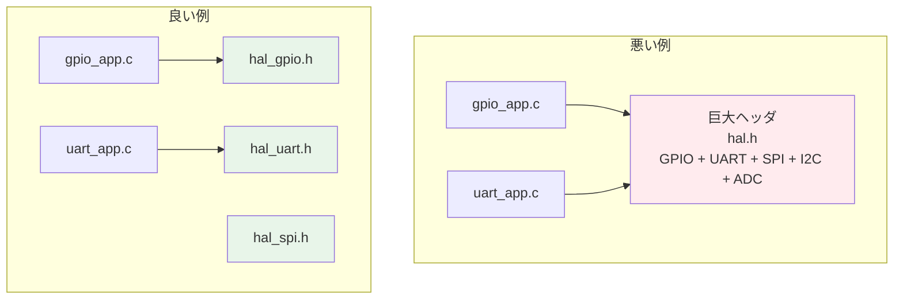
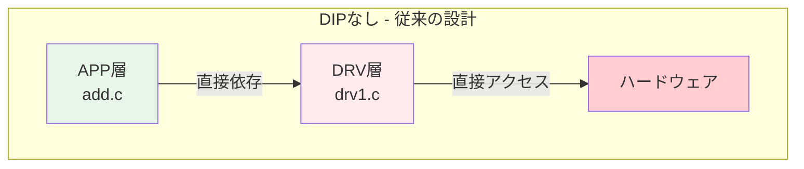
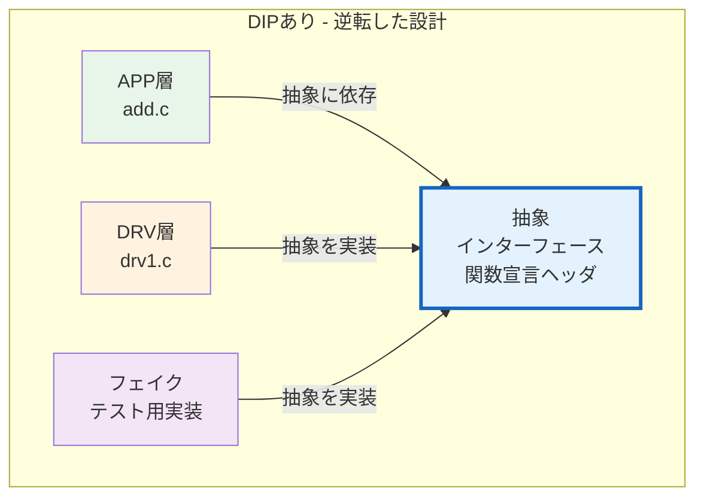
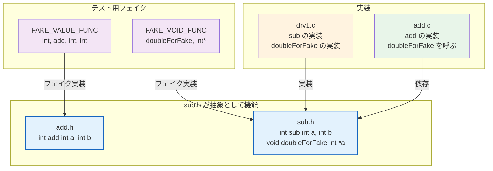
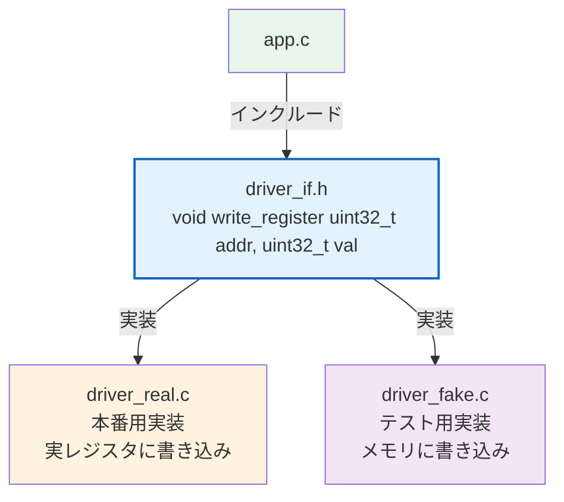
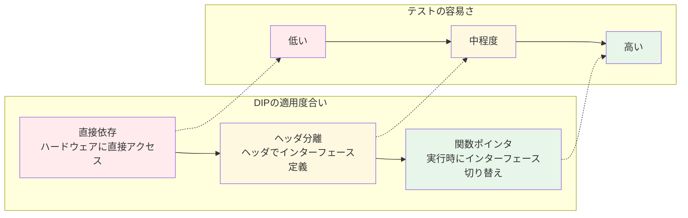

# 第5章: SOLID原則と依存性逆転 — テストしやすい設計とは

## 5.1 SOLID原則の概要

SOLID原則は、ソフトウェア設計の5つの基本原則です。組み込みC開発においても、テストしやすく保守しやすいコードを書くために重要です。



本教材では特に**D（依存性逆転の原則：DIP）**に注目しますが、まず各原則を組み込みCの文脈で概観します。

## 5.2 各原則の組み込みCでの適用

### S: 単一責任の原則（SRP）

> 「モジュールは、変更の理由を1つだけ持つべきである」



組み込みCでは、1つの `.c` ファイルに多くの機能を詰め込みがちです。機能ごとにファイルを分割することで、テストが書きやすくなります。

### O: 開放閉鎖の原則（OCP）

> 「拡張に対して開いており、修正に対して閉じているべきである」



C言語ではインターフェースや継承が言語機能として存在しませんが、**関数ポインタ**を使うことで同様の柔軟性を実現できます。

### L: リスコフの置換原則（LSP）

> 「基底型のオブジェクトを派生型のオブジェクトで置き換えても、プログラムの正しさが保たれるべきである」

C言語ではクラス階層がありませんが、関数ポインタのテーブル（≒インターフェース）を「基底型」と見なせば、どの実装に差し替えても同じ契約を満たすべきという原則が適用できます。



**LSPのポイント**: UART版、SPI版、テスト用フェイク、いずれの実装に差し替えても「送信したデータが相手に届く」「受信バッファからデータが読める」という**契約**が守られる必要があります。

### I: インターフェース分離の原則（ISP）

> 「クライアントが使わないメソッドに依存させてはならない」



組み込みCでは、HAL（Hardware Abstraction Layer）のヘッダを機能ごとに分割することが、この原則に相当します。

### D: 依存性逆転の原則（DIP）

> 「上位モジュールは下位モジュールに依存すべきではない。両者は抽象に依存すべきである」

この原則は、テスト可能な組み込みコード設計の**核心**です。

## 5.3 依存性逆転の原則（DIP）を深掘りする

### DIPが解決する問題

従来の組み込み設計では、アプリケーション層がドライバ層に直接依存しています。



この構造では、APP層をテストするにはDRV層（さらにはハードウェア）が必要になります。

### DIPの適用後



**依存の方向が逆転**しています。APP層は「抽象（ヘッダ＝インターフェース）」に依存し、DRV層もフェイクも同じ抽象を実装します。これにより、テスト時はフェイクに、本番時は実ドライバに切り替え可能になります。

### 本プロジェクトでのDIP

本プロジェクトのコードを見てみましょう。



- `sub.h` にはインターフェース（関数宣言）のみが記述されています
- `drv1.c` は本番用の実装を提供します
- `FAKE_VOID_FUNC` はテスト用のフェイク実装を提供します
- `add.c` は `sub.h` のインターフェースに依存し、具体的な実装には依存しません

## 5.4 C言語でのDIP実現パターン

C言語にはインターフェースの概念がありませんが、以下の方法でDIPを実現できます。

### パターン1: ヘッダファイルによる宣言と分離

最もシンプルなパターン。ヘッダに宣言だけを書き、実装は別ファイルに分ける。リンク時にどの実装を使うかを切り替えます。



本プロジェクトのFFFによるフェイクも、実質的にこのパターンを使っています。

### パターン2: 関数ポインタによる実行時切り替え

```c
// インターフェース定義
typedef struct {
    void (*write)(uint32_t addr, uint32_t val);
    uint32_t (*read)(uint32_t addr);
} DriverInterface;

// アプリケーション層 — 抽象に依存
void app_process(const DriverInterface *drv) {
    drv->write(0x1000, 0xFF);
    uint32_t val = drv->read(0x1000);
}
```

このパターンでは、実行時にインターフェースの実装を差し替えることができます。テスト時にはフェイクの実装を渡し、本番時には実ドライバの実装を渡します。

### パターン3: コンパイルスイッチによる切り替え

```c
#ifdef UNIT_TEST
    #include "driver_fake.h"
#else
    #include "driver_real.h"
#endif
```

最も原始的なパターンですが、既存コードへの導入が容易です。

### どのパターンを選ぶべきか

| パターン | 利点 | 欠点 | 適した場面 |
|---------|------|------|----------|
| パターン1: ヘッダ分離 | シンプル、既存コードに適用しやすい | 実行時に切り替えできない | 組み込みCの多くの場面。FFFとの相性が良い |
| パターン2: 関数ポインタ | 実行時に切り替え可能 | コードが複雑になる | プラグイン的な拡張が必要な場合 |
| パターン3: コンパイルスイッチ | 最も導入が容易 | 条件分岐が増えると保守困難 | 既存コードへの一時的な対応 |

本教材のプロジェクトでは**パターン1（ヘッダ分離）**を採用しています。その理由は以下の通りです。

1. **FFFとの相性が良い**: FFFは同じ関数名のフェイクをマクロで生成するため、ヘッダ分離パターンと自然に組み合わせられる
2. **組み込みCの慣習に合致**: 多くの組み込みプロジェクトでは既にヘッダとソースを分離しており、追加の設計変更が不要
3. **学習コストが低い**: 関数ポインタのパターンは強力だが、C言語初心者には理解が難しい

## 5.5 DIPとテストの関係

DIPの適用度合いによって、テストの容易さが変わります。



本教材のプロジェクトでは、「ヘッダ分離 + FFFによるリンク時切り替え」を採用しています。これは組み込みCにおいて最も実用的なバランスです。
