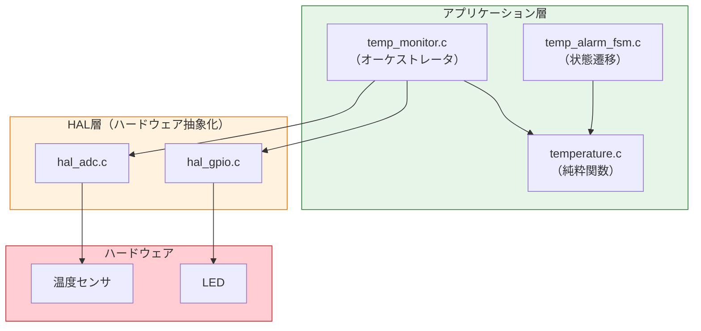
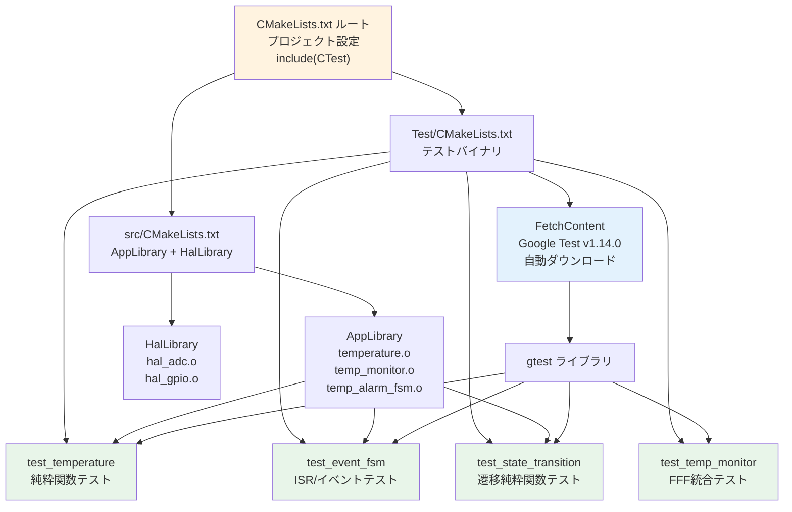
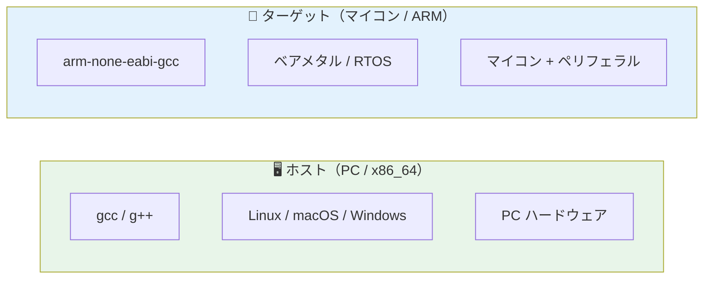

# 第6章: 環境構築とビルド

## 6.1 必要なツール

| ツール | 用途 | インストール方法 |
|--------|------|------------------|
| GCC / G++ | C/C++ コンパイラ | `sudo apt install build-essential` |
| CMake (3.14+) | ビルドシステム | `sudo apt install cmake` |
| Google Test | テストフレームワーク | CMake FetchContent で自動取得 |
| FFF (fff.h) | フェイク関数生成 | ヘッダファイル1つを配置 |

## 6.2 プロジェクト構成

```mermaid
graph TD
    ROOT["📁 プロジェクトルート"] --> SRC["📁 src/"]
    ROOT --> TEST["📁 Test/"]
    ROOT --> DOCS["📁 docs/"]
    ROOT --> CMAKE_ROOT["📄 CMakeLists.txt"]
    ROOT --> PRESET["📄 CMakePresets.json"]
    ROOT --> VSCODE_DIR["📁 .vscode/"]
    
    SRC --> APP["📁 app/ — アプリケーション層"]
    SRC --> HAL["📁 hal/ — HAL層"]
    SRC --> BEFORE["📁 before/ — 悪い例（教材用）"]
    SRC --> CMAKE_SRC["📄 CMakeLists.txt"]
    VSCODE_DIR --> VSCODE_SETTINGS["📄 settings.json"]
    VSCODE_DIR --> VSCODE_EXT["📄 extensions.json"]
    
    APP --> TEMP_H["📄 temperature.h/c — 純粋関数"]
    APP --> MON_H["📄 temp_monitor.h/c — オーケストレータ"]
    APP --> FSM_H["📄 temp_alarm_fsm.h/c — 状態遷移"]
    
    HAL --> ADC_H["📄 hal_adc.h/c — ADC抽象化"]
    HAL --> GPIO_H["📄 hal_gpio.h/c — GPIO抽象化"]
    
    TEST --> TEST_APP["📄 test_app.cpp — 純粋関数テスト"]
    TEST --> TEST_DRV["📄 test_drv.cpp — FFF統合テスト"]
    TEST --> TEST_FSM["📄 test_event_fsm.cpp — ISR/イベントテスト"]
    TEST --> TEST_TRANS["📄 test_state_transition.cpp — 遷移純粋関数テスト"]
    TEST --> FFF_H["📄 fff.h — フェイク生成ヘッダ"]
    TEST --> CMAKE_TEST["📄 CMakeLists.txt"]
    
    style APP fill:#e8f5e9
    style HAL fill:#fff3e0
    style BEFORE fill:#ffcdd2
    style TEST fill:#e3f2fd
```



### レイヤ分離の考え方



> **ポイント**: アプリケーション層は HAL のヘッダファイル（インターフェース）のみに依存する。HAL の実装（.c）はリンク時に差し替え可能。

## 6.3 CMakeによるビルドシステム

### CMakeのビルドフロー



### ルートCMakeLists.txt

```cmake
cmake_minimum_required(VERSION 3.29)
project(MyMixedProject LANGUAGES C CXX)
include(CTest)

add_subdirectory(src)
add_subdirectory(Test)

set(CMAKE_CXX_STANDARD 17)
set(CMAKE_CXX_STANDARD_REQUIRED YES)
set(CMAKE_C_STANDARD 99)
set(CMAKE_C_STANDARD_REQUIRED YES)
```

**ポイント**: `LANGUAGES C CXX` で、CとC++の両方を使うことを宣言しています。`include(CTest)` を使うことで、CTest と VS Code の Testing ビューからテストを見つけやすくします。

### src/CMakeLists.txt

```cmake
# === アプリケーション層 ===
set(APP_SOURCES
    app/temperature.c
    app/temp_monitor.c
    app/temp_alarm_fsm.c
)
add_library(AppLibrary STATIC ${APP_SOURCES})
target_include_directories(AppLibrary PUBLIC app hal)

# === HAL 層 ===
set(HAL_SOURCES
    hal/hal_adc.c
    hal/hal_gpio.c
)
add_library(HalLibrary STATIC ${HAL_SOURCES})
target_include_directories(HalLibrary PUBLIC hal)

target_link_libraries(AppLibrary PUBLIC HalLibrary)
```

### Test/CMakeLists.txt

```cmake
include(FetchContent)
FetchContent_Declare(
  googletest
  URL https://github.com/google/googletest/archive/refs/tags/v1.14.0.zip
)
FetchContent_MakeAvailable(googletest)

# 純粋関数テスト（フェイク不要）
add_executable(test_temperature test_app.cpp)
target_link_libraries(test_temperature gtest_main AppLibrary)
gtest_discover_tests(test_temperature)

# FFF 統合テスト（HAL をフェイクに差し替え）
add_executable(test_temp_monitor test_drv.cpp)
target_link_libraries(test_temp_monitor gtest_main)
target_include_directories(test_temp_monitor PRIVATE
    ${CMAKE_SOURCE_DIR}/src/app
    ${CMAKE_SOURCE_DIR}/src/hal
    ${CMAKE_CURRENT_SOURCE_DIR}
)
target_sources(test_temp_monitor PRIVATE
    ${CMAKE_SOURCE_DIR}/src/app/temp_monitor.c
    ${CMAKE_SOURCE_DIR}/src/app/temperature.c
)
gtest_discover_tests(test_temp_monitor)

# イベント/ISR テスト
add_executable(test_event_fsm test_event_fsm.cpp)
target_link_libraries(test_event_fsm gtest_main AppLibrary)
gtest_discover_tests(test_event_fsm)

# 純粋関数化した状態遷移テスト
add_executable(test_state_transition test_state_transition.cpp)
target_link_libraries(test_state_transition gtest_main AppLibrary)
gtest_discover_tests(test_state_transition)
```

> **重要**: `test_temp_monitor` は HalLibrary をリンクしません。代わりに FFF がテストファイル内で HAL 関数のフェイク実装を生成するため、リンカエラーにならずにテストできます。

## 6.4 ホスト環境とターゲット環境の違い



| 項目 | ホスト | ターゲット |
|------|--------|------------|
| コンパイラ | gcc / g++ | arm-none-eabi-gcc 等 |
| アーキテクチャ | x86_64 | ARM Cortex-M 等 |
| OS | Linux / macOS / Windows | ベアメタル / RTOS |
| メモリ | 数GB | 数KB〜数MB |
| ペリフェラル | なし | ADC, GPIO, UART, SPI... |
| テスト方法 | Google Test + FFF | 手動 / JTAG |

### 意識すべき差異

- **型サイズ**: `int` がホストでは32bit/64bit、ターゲットでは16bit/32bitの場合がある。`stdint.h`（`uint16_t` 等）を使うことで差異を吸収。
- **エンディアン**: ホストはリトルエンディアンだがターゲットがビッグエンディアンの場合がある。
- **浮動小数点**: ターゲットにFPUがない場合、浮動小数点演算は避ける → 本教材では整数演算（×10 表現）を使用。
- **アラインメント**: 構造体のパディングが異なる場合がある。

## 6.5 ビルドと実行

```bash
# 1. ビルドディレクトリ作成
mkdir build && cd build

# 2. CMake 設定
cmake ..

# 3. ビルド
cmake --build .

# 4. テスト実行
ctest --output-on-failure
```

実行結果（全34テストがパス）:

```
100% tests passed, 0 tests failed out of 30
```

## 6.6 VS Code GUI でビルドとテスト

このワークスペースには、CMake Tools の GUI 操作用に `CMakePresets.json` と `.vscode/settings.json` を追加しています。これにより、VS Code のステータスバーや Testing ビューからも、ターミナル確認時と同じ `build/` と test preset を使って操作できます。

1. ワークスペースを開き、推奨拡張機能の `ms-vscode.cmake-tools` と `ms-vscode.cpptools` を有効にする
2. CMake Tools が preset を読み込んだら、ステータスバーの Configure を実行する
3. ステータスバーの Build でビルドし、Testing ビューまたは CMake の Run Tests でテストを実行する
4. Testing ビューで 34 テストの PASS/FAIL を確認する

確認済み:

- このワークスペースでは、VS Code の CMake Tools で `default` preset を選択後、Build と Run Tests の両方が成功します

補足:

- `CMakePresets.json` の `default` preset が configure/build/test の基準になります
- `.vscode/extensions.json` は必要な拡張機能をワークスペース推奨として表示します

## 6.7 VS Code GUI のトラブルシュート

- `No configure preset is active for this CMake project` と表示されたら、CMake Tools の configure preset を `default` に切り替えてから再度 Configure します
- テスト一覧が出ない、または CMake 変更前の状態を拾う場合は、まず Configure を再実行します。改善しなければ `build/` を削除して再構成します
- ルート `CMakeLists.txt` では `include(CTest)` を使います。Testing ビューや GUI 側のテスト実行は、この設定で安定してテストを見つけられる前提です

## 6.8 Google Tests ビューでのテスト実行

Google Tests ビューとして `davidschuldenfrei.gtest-adapter` を使う場合は、`.vscode/launch.json` に定義した各 Google Test バイナリの launch 構成を読み込ませます。

1. 推奨拡張機能の `davidschuldenfrei.gtest-adapter` を有効にする
2. `default` preset で一度ビルドし、`build/Test/` 配下に実行ファイルを生成する
3. Test Explorer で各 Google Test バイナリを読み込み、そのまま個別または一括で実行する

設定の要点:

- `gtest-adapter.debugConfig` に 5 本の launch 構成名を設定
- `.vscode/launch.json` の `GTest: ...` 構成が `build/Test/*.exe` を直接指す
- Windows では `cppdbg + gdb` で `C:/bin/mingw64/bin/gdb.exe` を使う
- `.vscode/settings.json` には別途 `testMate.cpp.*` 設定も残してあり、C++ TestMate を使う場合の代替導線にも対応している

### 6.8.1 Test Explorer での確認手順

1. ビルド後に Test Explorer を開き、必要ならテスト一覧の再読込を実行する
2. `test_temperature`, `test_temp_monitor`, `test_event_fsm`, `test_state_transition`, `test_autosar_hal` の5バイナリが見えることを確認する
3. まず純粋関数系の `test_temperature` または `test_state_transition` を単体実行する
4. 最後に全体実行し、合計 34 テストが通ることを確認する

確認ポイント:

- テスト一覧が空なら、ビルド済みかどうかと `build/Test/` 配下の実行ファイル有無を先に確認する
- 再ビルド直後に一覧更新が追いつかない場合は、Test Explorer から再読込を明示的に実行する
- `You first need to define a debug configuration, for your tests` と出る場合は、`.vscode/launch.json` が未反映のことが多いので、ワークスペース再読込後に Refresh する
- `gtest-adapter.debugConfig` は拡張 v1.8.3 の設定スキーマ都合で警告表示されることがあるが、実際の拡張実装は配列を受け付ける
