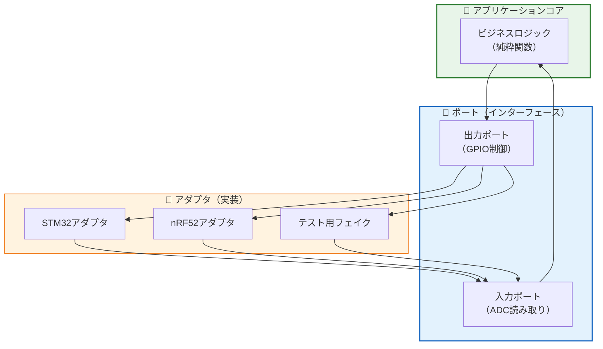
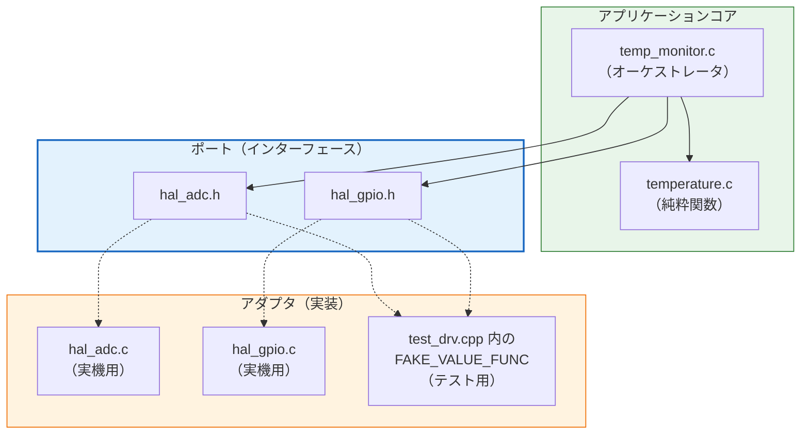
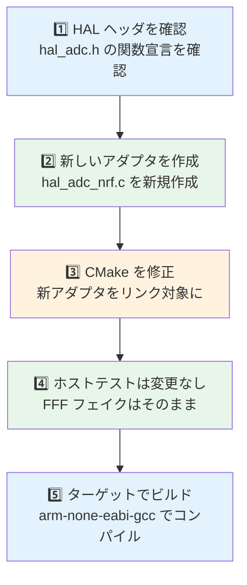
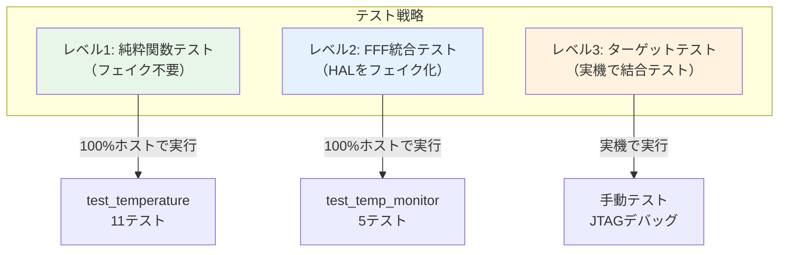

# 第6章: ポートアダプタパターン

## 6.1 ポートアダプタとは

ポートアダプタパターン（別名: ヘキサゴナルアーキテクチャ）は、アプリケーションのコアロジックを外部依存から分離する設計パターンです。

## 6.2 本教材での実現

DIP（第5章）で学んだ原則を、アーキテクチャレベルで適用したものがポートアダプタです。

### C言語での対応表

| ポートアダプタの概念 | 本教材での実装 | ファイル |
|--------------------|---------------|---------|
| アプリケーションコア | 純粋関数群 | `temperature.c` |
| オーケストレータ | 統合ロジック | `temp_monitor.c` |
| ポート | HAL ヘッダファイル | `hal_adc.h`, `hal_gpio.h` |
| 実機アダプタ | HAL 実装 | `hal_adc.c`, `hal_gpio.c` |
| テストアダプタ | FFF フェイク | `test_drv.cpp` 内 |

### プロジェクト構造との対応

## 6.3 DIP との関係

ポートアダプタパターンは DIP をアーキテクチャ全体に適用したものです。

| レベル | 概念 | 実装 |
|--------|------|------|
| 原則 | DIP（依存性逆転） | 上位→抽象←下位 |
| パターン | ポートアダプタ | コア＋ポート＋アダプタ |
| 実装 | HAL + リンカ差し替え | ヘッダ(.h) + 実装(.c) 分離 |

## 6.4 新しいターゲットへの移植手順

> **ポイント**: アプリケーションコード（`temperature.c`, `temp_monitor.c`）は一切変更不要。HAL の実装ファイルだけを追加すれば、新しいハードウェアに対応できる。

## 6.5 テスト戦略

| レベル | 対象 | 方法 | カバー範囲 |
|--------|------|------|-----------|
| 純粋関数テスト | `temperature.c` | Google Test のみ | ロジック100% |
| FFF統合テスト | `temp_monitor.c` | Google Test + FFF | 統合フロー |
| ターゲットテスト | HAL 実装 | 実機 + JTAG | ハードウェア接続 |

> **目標**: レベル1 と レベル2 でバグの90%以上を検出し、ターゲットテストは最小限にする。
