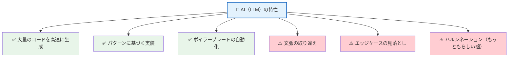
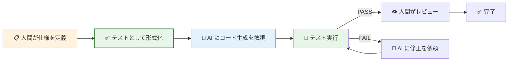
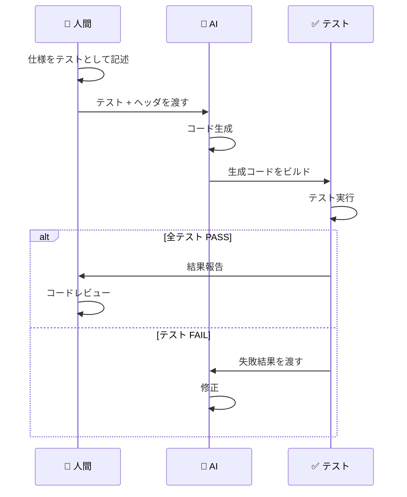
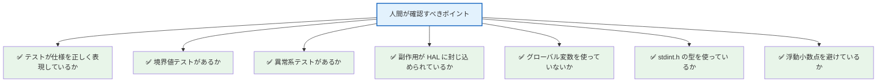
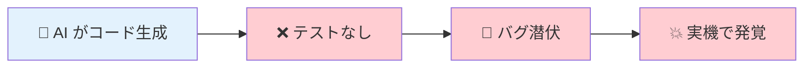
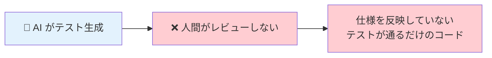
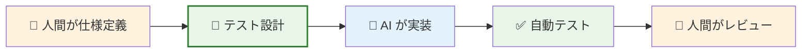
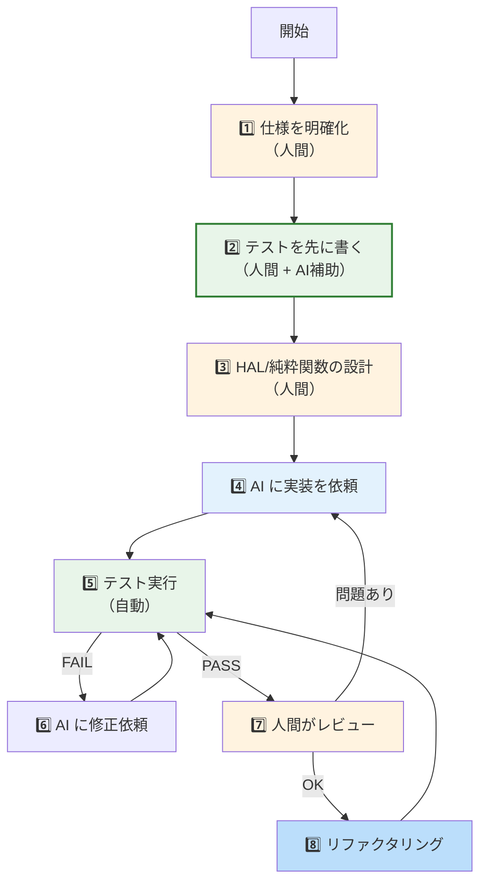

# 第7章: AI駆動開発とTDD

## 7.1 なぜ AI 時代に TDD が重要か

AI（大規模言語モデル / LLM）がコードを生成できる時代になりました。しかし、AI が生成するコードには以下の特性があります。



### TDD が AI の弱点を補う論理

```
前提1: AI は仕様を正しく理解しているとは限らない
前提2: テストは「仕様の形式化」である
前提3: テストが先にあれば、AI 生成コードの正しさを自動検証できる
結論: AI 駆動開発では TDD がさらに重要になる
```



## 7.2 AI駆動開発のワークフロー

### ステップ1: 仕様をテストとして書く（人間）

```cpp
// 人間がまず「何が正しいか」をテストで定義する
TEST(TemperatureConvert, ZeroInput) {
    EXPECT_EQ(0, temperature_convert(0));
}

TEST(TemperatureConvert, MaxInput) {
    EXPECT_EQ(330, temperature_convert(4095));
}

TEST(TemperatureIsValid, SensorDisconnected) {
    EXPECT_EQ(0, temperature_is_valid(0));
}
```

### ステップ2: AI にコード生成を依頼

```
【AI への指示例】
以下のヘッダファイルの関数を実装してください。
テストファイル test_app.cpp が全て PASS するようにしてください。

条件:
- 純粋関数として実装
- stdint.h の型を使用
- 浮動小数点は使用しない
- ADC は 12bit (0-4095)、基準電圧 3.3V
```

### ステップ3: テスト実行 → レビュー



## 7.3 人間が気をつけるべきこと

### 人間 vs AI の責任分担

| 責任 | 人間 | AI |
|------|------|-----|
| 仕様の定義 | ✅ 主担当 | 参考意見 |
| テストの設計 | ✅ 主担当（境界値、異常系） | 補助生成 |
| コード生成 | レビュー | ✅ 主担当 |
| テスト実行 | 結果確認 | ✅ 自動実行 |
| アーキテクチャ決定 | ✅ 主担当 | 提案 |
| セキュリティ確認 | ✅ 最終確認 | スキャン |

### 人間が確認すべきチェックリスト



## 7.4 AI に出す指示のベストプラクティス

### 良い指示の例

```
✅ 「temperature_convert 関数を実装してください。
    - 入力: uint16_t raw_adc (0-4095)
    - 出力: int16_t (温度×10)
    - 変換式: mv = raw * 3300 / 4095, temp_x10 = mv / 10
    - テストファイル test_app.cpp が全 PASS すること」
```

### 悪い指示の例

```
❌ 「温度変換する関数を作って」
→ 仕様が曖昧で、AI が勝手に浮動小数点を使ったり、
  型が合わなかったりする
```

### AI 指示テンプレート

```
【関数実装の依頼】
■ 対象ヘッダ: (ファイルパス)
■ 関数名: (関数名)
■ 制約条件:
  - 純粋関数 / HAL関数のどちらか
  - 使用する型（stdint.h）
  - 浮動小数点の使用可否
  - 対応するテストファイル
■ テスト実行コマンド:
  cd build && cmake --build . && ctest --output-on-failure
```

## 7.5 アンチパターン

### ❌ テストなしで AI にコード生成させる



### ❌ AI 生成テストを鵜呑みにする



### ✅ 正しいフロー



## 7.6 まとめ: AI 時代の開発フロー


